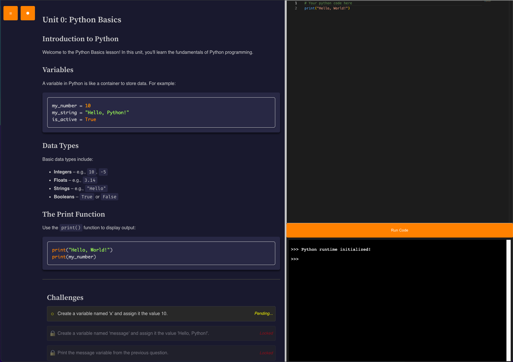

# Building Python Programs: Interactive Web-Based Python Course

[](https://opensource.org/licenses/MIT)

## Overview
Building Python Programs is a fully interactive, web-based Python course that enables learners to experiment with Python directly in the browser. It provides a structured curriculum inspired by modern coding environments like VS Code and PyCharm, allowing users to write, execute, and debug Python code seamlessly.



## Features
- **Structured Curriculum**: Step-by-step units covering everything from basic syntax to advanced concepts.
- **Interactive Python Editor**: Powered by [Monaco Editor](https://microsoft.github.io/monaco-editor/) for an enhanced coding experience.
- **In-Browser Code Execution**: Uses [Pyodide](https://pyodide.org/) to run Python code directly in the browser.
- **Integrated Terminal**: Provides real-time interaction via [xterm.js](https://xtermjs.org/).
- **Real-Time Syntax Highlighting**: Enhanced with [Prism.js](https://prismjs.com/) for better readability.
- **Dark/Light Theme Toggle**: Persistently saves user preferences.
- **Resizable Lesson & Code Areas**: Allows dynamic adjustment using a draggable splitter.
- **Step-by-Step Challenges**: Progressive coding exercises that guide learners through Python basics.

## Tech Stack
- **Frontend Technologies**:
  - HTML5 Semantic Markup
  - CSS3 with Custom Properties & Responsive Layout (Flexbox/Grid)
  - Vanilla JavaScript for interactivity and DOM manipulation
- **Code Editor & Execution**:
  - [Monaco Editor](https://microsoft.github.io/monaco-editor/) for editing Python code.
  - [Pyodide](https://pyodide.org/) for running Python in the browser.
- **Syntax Highlighting**:
  - [Prism.js](https://prismjs.com/) with custom enhancements for Python.
- **Fonts**:
  - [Fira Sans](https://fonts.google.com/specimen/Fira+Sans)
  - [Fira Mono](https://fonts.google.com/specimen/Fira+Mono)

## Directory Structure
```
building-python-programs/
├── assets/
│   ├── css/
│   │   └── style.css          # Main styles, theming, and responsive layout
│   ├── js/
│   │   ├── main.js            # Theme and sidebar toggle functionality
│   │   ├── interpreter.js     # Python code execution with Pyodide
│   │   ├── splitter.js        # Resizable lesson and code area functionality
│   │   ├── challenges.js      # Challenge validation logic
│   ├── templates/
│   │   └── unit.html          # Template for new course units
├── units/
│   ├── unit-0.html            # Unit 0: Getting Started
│   ├── unit-0.json            # JSON data for Unit 0 challenges
├── index.html                 # Homepage integrating lessons and editor
├── README.md                  # Project documentation
```

## Getting Started
### Installation
1. **Clone the Repository**:
   ```sh
   git clone https://github.com/your-username/building-python-programs.git
   ```
2. **Open in Browser**:
   ```sh
   cd building-python-programs
   open index.html  # Or double-click index.html
   ```

### Running Code
1. Navigate to `index.html` in your browser.
2. Enter Python code in the Monaco Editor.
3. Click **Run Code** to execute and view results in the integrated terminal.

## How It Works
### Editor & Terminal Integration
- `interpreter.js` initializes Monaco Editor and xterm.js.
- Pyodide executes the Python code in-browser.
- Overrides `input()` to work asynchronously with the terminal.

### Dynamic Theming & Layout
- `main.js` handles dark/light mode and sidebar collapsing.
- `splitter.js` enables resizable lesson/code areas.

### Challenges System
- `challenges.js` loads JSON-based challenges.
- It validates user code execution results dynamically.

## Customization
### Modifying Themes
Customize the appearance by modifying CSS variables in `style.css`. For example:
```css
:root {
  --rust-accent: #f74c00;
  --rust-code-bg: #f5f2f0;
}
[data-theme="dark"] {
  --rust-accent: #ff8c00;
  --rust-code-bg: #2d2d4d;
}
```

### Adding New Units
1. **Create a New Unit**:
   ```sh
   cp assets/templates/unit.html units/unit-X.html
   ```
2. **Update the Unit**:
   - Modify the `<title>` and header to reflect the new unit's title.
   - Adjust navigation links in both the new unit and the sidebar.
   - Populate the content sections with your lesson materials and code examples.
3. **Create a JSON File for Challenges**:
   ```sh
   touch units/unit-X.json
   ```
   - Add coding exercises in JSON format like `unit-0.json`.

## Contributing
Contributions are welcome! To contribute:
1. **Open an Issue:** Describe your proposed changes.
2. **Fork the Repository.**
3. **Create a Feature Branch**:
   ```sh
   git checkout -b feature/your-feature-name
   ```
4. **Commit Your Changes**:
   ```sh
   git commit -m 'Describe your feature or fix'
   ```
5. **Push the Branch**:
   ```sh
   git push origin feature/your-feature-name
   ```
6. **Open a Pull Request** describing your changes for review.

## License
This project is distributed under the MIT License. See the [LICENSE](./LICENSE) file for details.

## Acknowledgments
- [Prism.js](https://prismjs.com/) for syntax highlighting.
- [Monaco Editor](https://microsoft.github.io/monaco-editor/) for the interactive code editor.
- [Pyodide](https://pyodide.org/) for running Python in the browser.
- Google Fonts for Fira Sans and Fira Mono typefaces.
- Inspiration from "The Rust Programming Language" book.
